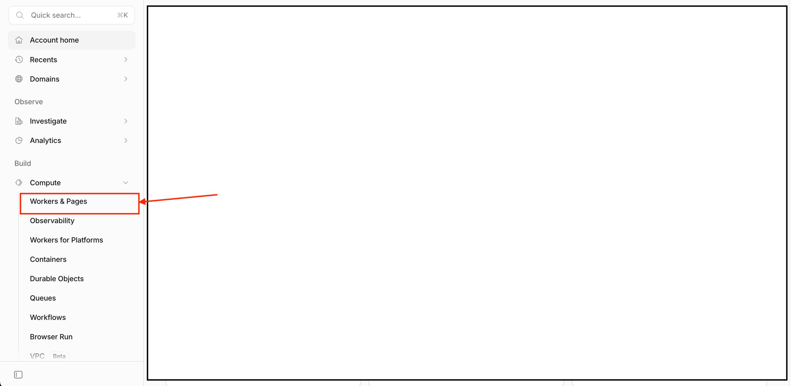
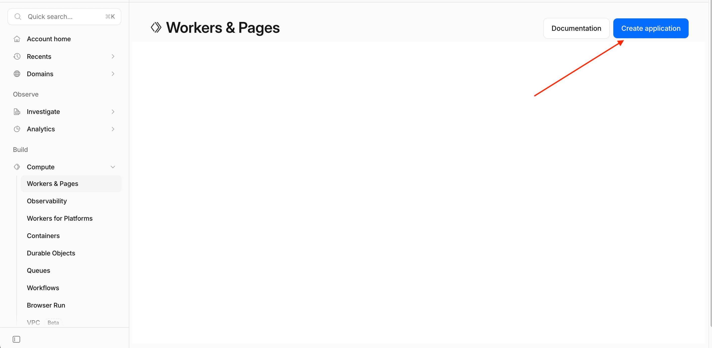
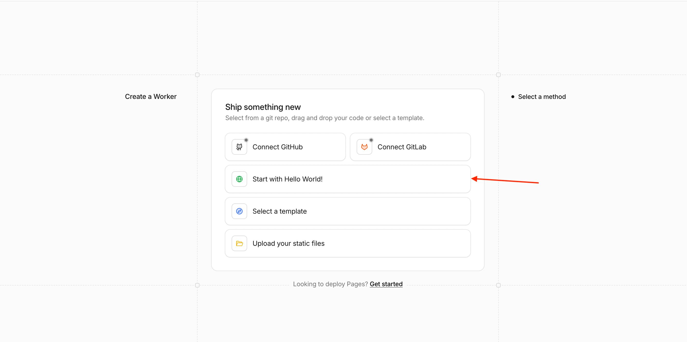
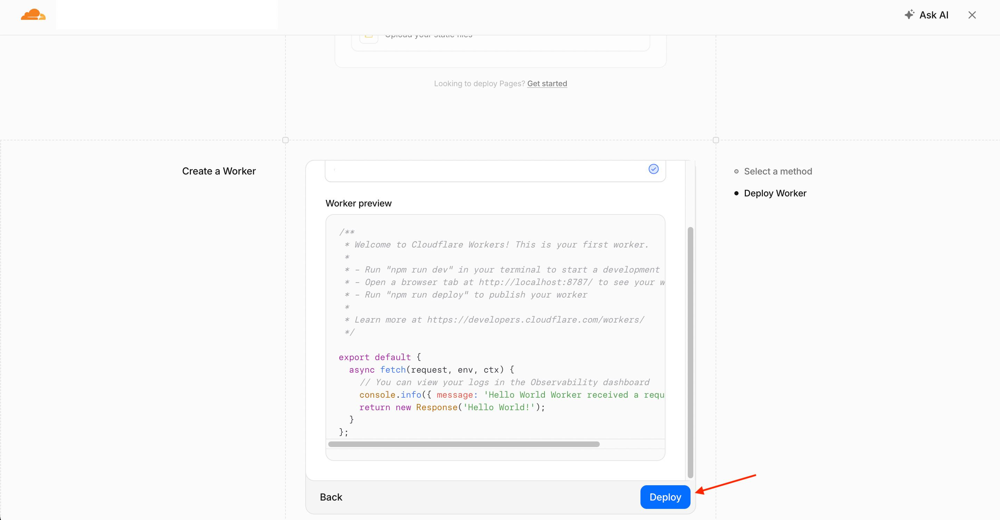
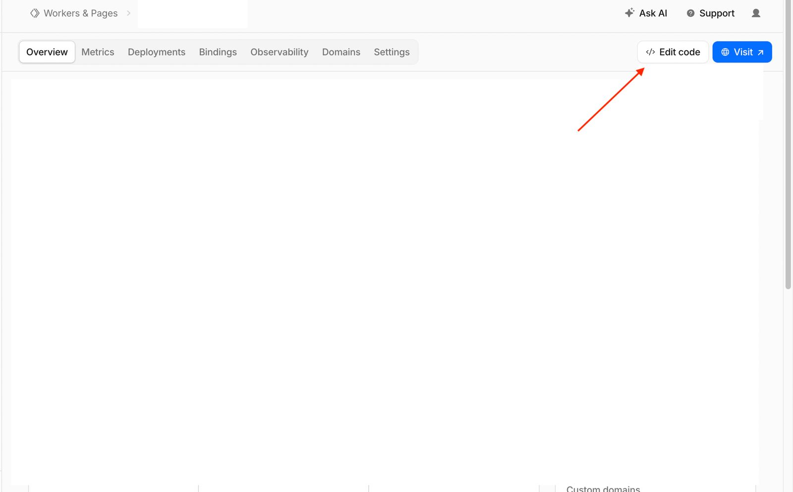
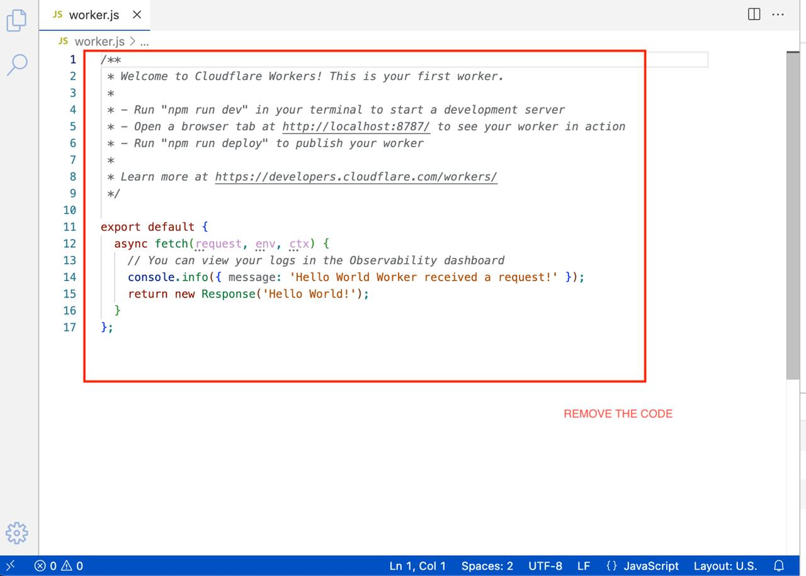
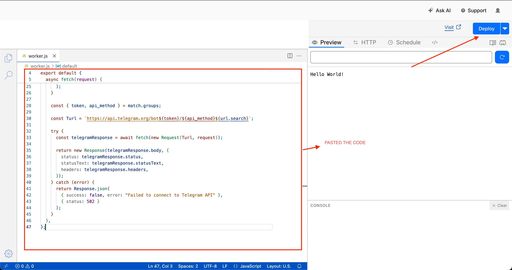

# Telegram Bot API Reverse Proxy (Cloudflare Worker)

A lightweight and fast Cloudflare Worker script that acts as a reverse proxy for the official Telegram Bot API. 

## Why and When to Use This

Recently, access to `api.telegram.org` has been restricted or completely blocked by ISPs in certain regions. If you are hosting a Telegram bot on a server or local machine in an affected region, your bot will fail to send messages or fetch updates because it cannot connect to Telegram's servers.

**Use this script when:**
*   **Telegram is Blocked:** You need a reliable way to bypass ISP or regional network blocks on `api.telegram.org`.
*   **IP Whitelisting:** You want your API requests to originate from Cloudflare's IP ranges rather than your server's IP.

## How It Works

Instead of your bot code making requests directly to `https://api.telegram.org/bot<TOKEN>/<METHOD>`, you configure your bot library to send requests to your Cloudflare Worker URL: `https://<YOUR_WORKER_URL>/bot<TOKEN>/<METHOD>`. 

The Worker receives the request, safely extracts your bot token and API method, forwards the exact request to Telegram's official API, and returns Telegram's response directly to your bot.

---

## Setup Guide

The easiest way to deploy this is directly through the Cloudflare Dashboard. It takes less than 5 minutes and requires no local installation.

### Step 1: Create a Cloudflare Worker
1. Log in or sign up at [Cloudflare Dashboard](https://dash.cloudflare.com).
2. On the left sidebar, navigate to **Workers & Pages**.

3. Click the **Create application** button.

4. Click **Start with Hello World!**.

5. Click **Deploy**.


### Step 2: Add the Code
1. Once deployed, click the **Edit code** button to open the online code editor.

2. Delete all the default boilerplate code in the `worker.js` file.

3. Copy the proxy script provided in `index.js` and paste it into the editor.
4. Click the **Deploy** button in the top right corner to save and publish your changes.


### Step 3: Get Your Worker URL
1. After deploying, return to your Worker's overview page.
2. You will see a domain assigned to your worker (e.g., `https://tg-api-proxy.<your-username>.workers.dev`). 
3. Save this URL! This is your new Telegram API base URL.

---

## Usage

To use the proxy, simply replace the standard Telegram API base URL (`https://api.telegram.org`) with your new Cloudflare Worker URL in your bot's code or library configuration.

### Example (cURL)

**Standard Request (Blocked):**
```bash
curl "[https://api.telegram.org/bot123456:ABC-DEF1234ghIkl-zyx57W2v1u123ew11/getMe](https://api.telegram.org/bot123456:ABC-DEF1234ghIkl-zyx57W2v1u123ew11/getMe)"

```

**Proxy Request (Working):**

```bash
curl "https://tg-api-proxy.<your-username>.workers.dev/bot123456:ABC-DEF1234ghIkl-zyx57W2v1u123ew11/getMe"

```


## Health Check

You can verify your proxy is active by visiting your worker's root URL in a web browser:
`https://tg-api-proxy.<your-username>.workers.dev/`

You should see:

```json
{
  "success": true,
  "message": "Everything looks good and running."
}

```